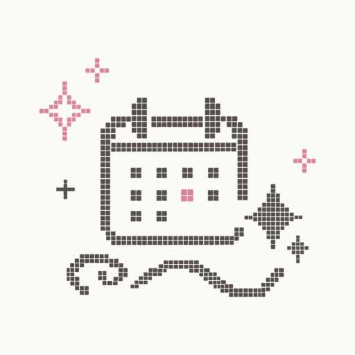

# App icon

Everything shipped under `public/icons/` plus `public/favicon.ico` is generated:

```
node scripts/build-app-icon.mjs
```

The only input is `public/splash-mark.png` — the mark alone on transparency, which the launch
screen in `index.html` already uses. Nothing here is hand-exported, so an icon change is a change
to that artwork or to the `RECIPE` block at the top of the script, never to a binary.

## The recipe

| | |
| --- | --- |
| Ground | flat, full-bleed, opaque — `#3A3533` (ink) or `#FAFAF9` (paper) |
| Corners | square. The platform masks the tile itself |
| Mark | centred on its own bounding box, spanning **78%** of the canvas across |
| Maskable render | the same, at **62%** across, to sit inside Android's 80% safe circle |
| Sizes | 512, 180, 128, 96, 32, 16 PNG, plus 48/32/16 inside `favicon.ico` |

## Choosing the ground

`SHIPPED` in `scripts/build-app-icon.mjs` selects one of `GROUNDS`. Flip the line, rerun, commit
the result. Both grounds render to this folder on every build, so they can be compared without a
rebuild:

| ink (shipped) | paper |
| --- | --- |
|  |  |

**ink** is a deep warm neutral, one step darker than the artwork's own `#524B48` stroke; the mark
inverts to `#FAFAF9` and the accent lifts to `#EE96AF`, because the artwork's own pink sits at
roughly 3:1 on that ground and the dots it colours are four art-pixels across. Its cost is that the
tile no longer matches the cream the app opens onto, so there is a step in colour at launch.

**paper** is exactly `--color-bg`, which is also the manifest's `background_color` and the launch
screen's ground — icon, splash and first painted frame are one colour, at the price of a very light
tile on a dark home screen.

## What this replaced, and why it is written down

The previous icons were hand-exported binaries with no recipe, and they carried three faults that
only a recipe prevents coming back:

1. **A rounded plate baked into the bitmap.** iOS masks the tile with its own superellipse and
   Android with the launcher's shape, so a radius inside the image renders as a second, mismatched
   corner within the platform's own. Invisible in a file viewer, visible on a home screen.
2. **A scanned paper texture as the ground** rather than a flat colour. Roughly `#FCF7F6` with
   grain, which is what read as a sheet of white paper next to flat-coloured neighbours — and what
   made the 512 weigh 318 KB, against 55 KB now.
3. **Artwork sized to 81% of the canvas across but only 70% down.** The right-hand sparkle sat
   against the mask edge while the top and bottom stood empty, so the mark read as off-centre even
   though its bounding box was within 8px of true.
